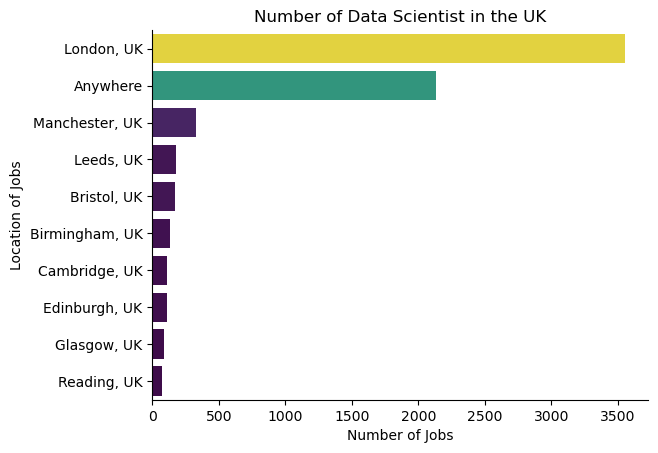
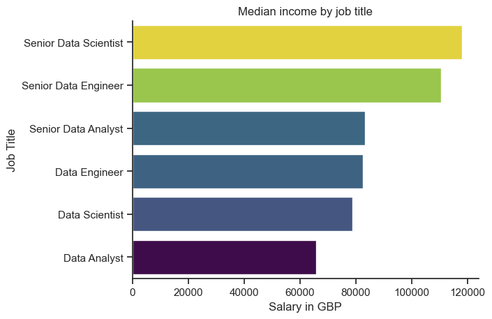
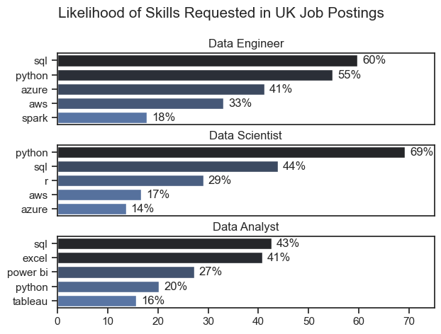
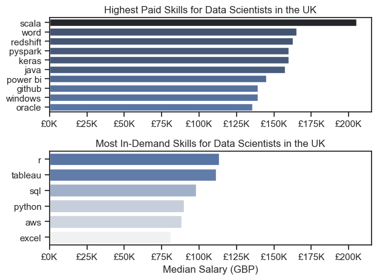
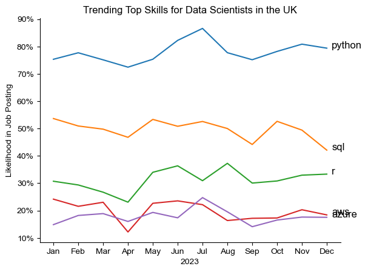
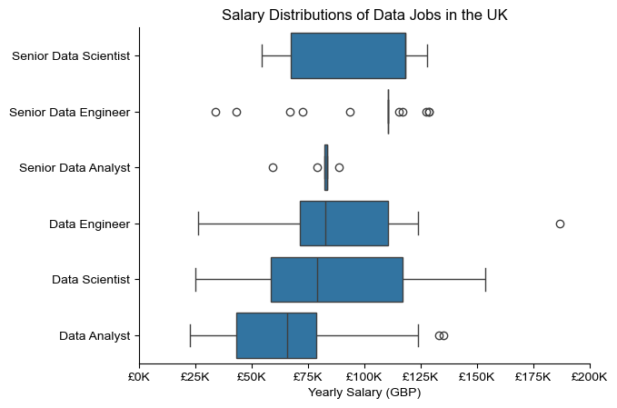
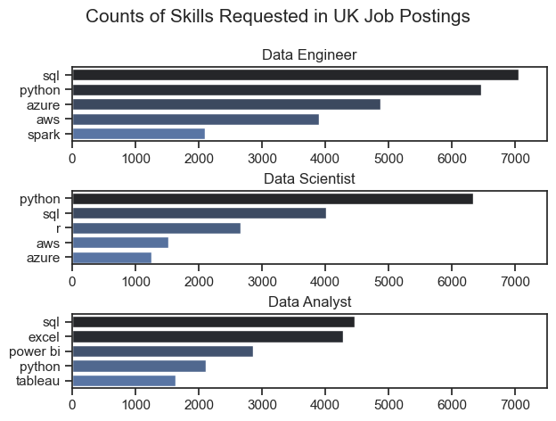

This project involved performing Data Analysis of this dataset https://huggingface.co/datasets/lukebarousse/data_jobs to find insights for the UK 

# Key Insights
Key Insights:

1. Job Market in the UK 

    London leads with approximately 2,500 jobs, followed by working form anywherein the UK. Manchester, Leeds, and other cities also have some opportunities. Recruitment companies such as Harnhan mostly post Data Sciece job opportunities with Natwest being the top individual lister for 2023 according to the data set
    

    

2. Demand and Salary for Skills in Data Roles:

    For UK Data Engineers: SQL (55%) and Python (50%) are highly requested, with median salaries around £82.5K for standard Engineers and £110k for Senior Data Engineers

    Data Scientists: Python (59%) and SQL (44%) are prominent, with median salaries around £79K for standard Data Scientists and £119K for Senior  Data Scientists

    Data Analysts: SQL (41%) and Excel (41%) are most in-demand, with moderate median salaries around £65k for standard Data Analysts and £83K for Senior Data Analysts.
    
    

3. High Salary Skills:

    scala and redshift command the high median salaries (around £160K and over £200K respectively), though they are less commonly requested.

    R, tableau, SQL, Python, AWS and MS Excel offer good median salaraies and have more demand
    

4. Skill Popularity Trends (UK 2023):

    Python consistently ranks highest among data skills throughout the year.

    SQL shows a slight decline but remains second most popular.

    R, Excel, and Tableau have stable, lower popularity levels.
    

5. Salaries by Role:

    Senior Data Scientist: Highest median salary, with wide salary range.

    Senior Data Engineer/Data Analyst: Similar median salaries, slightly lower than Senior Data Scientist.

    Data Engineer/Scientist: Moderate median salaries.

    Data Analyst: Lowest median salary among listed roles.
    
    

6. Top Skills for UK Data Scientists, Engineers and Analysts:

    For Data Scientists Python, SQL and R have significant presence
    For Data Engineers Python, SQL and Azure have significant presence
    For Data Analysts Excel, SQL and Power Bi have significant presence
    
    